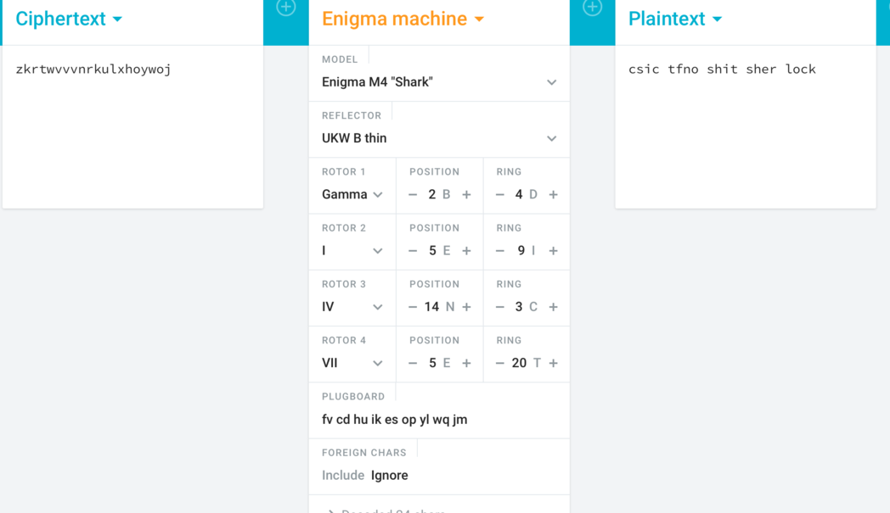

## Mein Kampf ##

We are given the briefing:

```
"We have intercepted the enemy's communications, but unfortunately, some data was corrupted during transmission. Can you recover the message?"  
M4 UKW $ Gamma 2 4 $ 5 9 $ 14 3 $ 5 20 fv cd hu ik es op yl wq jm

Ciphertext: zkrtwvvvnrkulxhoywoj
(Words in the flag are separated by underscores)
```

Googling `M4 UKW` we find out this is a type of enigma. M4 means there are 4 rotors; Gamma is the setting for the first rotor; the preceding 4 pairs of numbers 
are position and ring values respectively and the string of letters at the end are the plugboard values. 

This leaves us with almost everything needed to decrypt the ciphertext. However we are not given the values for rotor 2,3 and 4. They can be in any position 
from the range I to VIII, so bruteforcing this we get the values as follows:  
rotor 2 = I  
rotor 3 = IV  
rotor 4 = VII

Using [this website](https://cryptii.com/pipes/enigma-decoder), we get the flag:



`csictf{no_shit_sherlock}`
