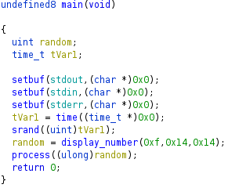
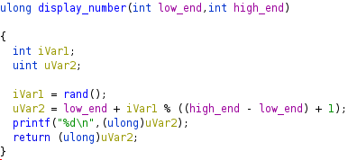
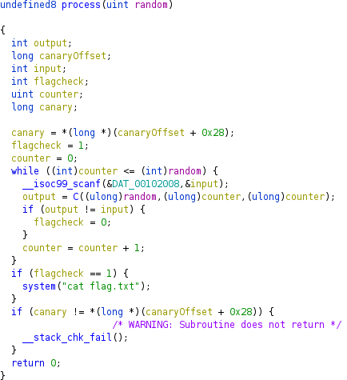
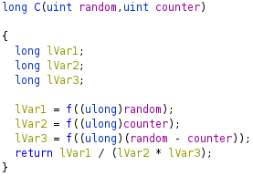
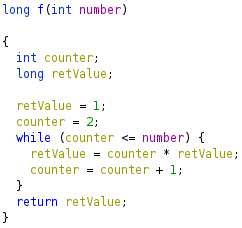

# Blaise

## File Info

Running `file blaise` gives us this output:
```
blaise: ELF 64-bit LSB shared object, x86-64, version 1 (SYSV), dynamically linked, interpreter /lib64/ld-linux-x86-64.so.2, BuildID[sha1]=00fb13e98a303dff4159e894942e363208415ba1, for GNU/Linux 3.2.0, not stripped
```

Important thing here is it *isn't* stripped, that it is *dynamically* linked, and it's *64-bit*, which will make the rev easier

## Running the file

When we first run the file, we are given a two digit number, like so:

```
$ ./blaise
15

```

And we are promted for input. Inputting letters seems to end it, however typing a number keeps it running, and we can enter more:
```
$ ./blaise
19
12
24
a
$
```

## Ghidra

Let's throw it into ghidra to see the pseudo-c code of the file. I've prepared the decompilation by renaming functions and variable already. Here's what our main function looks like:



However there isn't much useful info here, although we know that it calls the functions `display_number` and `process`

Let's decompile `display_number`:



We see here that is basically:
* generates a random number between 15 and 20 (0xf and 0x14) 
* prints it 
* returns it

Let's decompile `process` now:



This is most important function, and a lot is going on here:

* Firstly, we basically create a for loop using counter and the random number as the end

* Then with `scanf` we read the input

* Then with counter, and random number, we call another function called `c`, and output is stored in `output`. We'll come back to this in a bit

* Then it compares this output with our input, and if they aren't equal it sets `flagcheck` to false

* Increments counter, and starts loop again

* Finally, at the end, it checks if `flagcheck` is `true`, if it is, it gives us the flag

So, in order to do this challenge, we need to write a script that constantly gives a number to the program, that equals the output of `c`, then reads the flag

## function `c`

Let's decompile `c`:



So it makes 3 variables, using the `f` function, and then returns a value based on those 3. 

Lets' decompile `f`:



Just does some maths with the provided number. 

## Scripting

To convert our two numbers (random and counter) to what is needed of the program, we'll port these functions to python, like so:

```python
def f(num):
	ret = 1
	counter = 2
	while counter <= num:
		ret *= counter
		counter += 1
	return ret

def c(ran, counter):
	num1 = f(ran)
	num2 = f(counter)
	num3 = f(ran - counter)
	return num1 / (num2 * num3)
```

Using these, and pwntools, we can write our final script, like so:

```python
from pwn import *
from sys import argv

if argv[1] == "r": 
	p = remote("chall.csivit.com", 30808)
else:
	e = ELF("./blaise")
	p = e.process()


rand = int(p.recvline())  # Recieves random number
log.info(f"random number: {rand}")

def f(num):
	ret = 1
	counter = 2
	while counter <= num:
		ret *= counter
		counter += 1
	return ret

def c(ran, counter):
	num1 = f(ran)
	num2 = f(counter)
	num3 = f(ran - counter)
	return num1 / (num2 * num3)

for i in range(0, rand + 1):
	data = int(c(rand, i))  # Gets required number
	p.sendline(str(data))   # Sends
	flag = p.clean()
	if flag:  # I was lazy :p
		log.info(f"flag is: {flag.decode()}")
		exit()
```

**csictf{y0u_d1sc0v3r3d_th3_p4sc4l's_tr14ngl3}**
