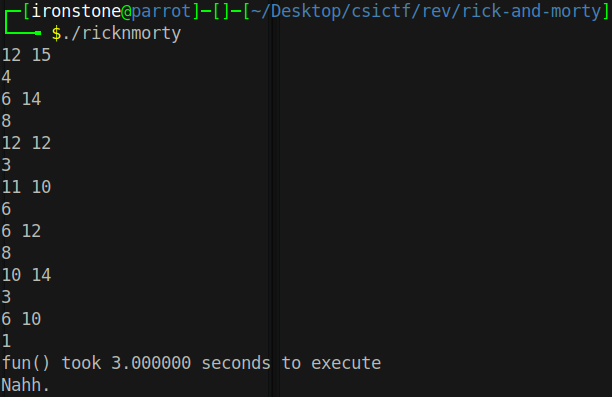

# RicknMorty
First, let's see what running the program does.



> Note: The pairs of numbers are the program, the singular numbers are me typing back to it.

There's nothing particularly clear here, so let's disassemble it in GHidra.

```c
int main(void)
{
  int random;
  time_t tVar1;
  long result;
  long input;
  time_t local_40;
  time_t local_38;
  time_t local_30;
  long number2;
  long number1;
  char *time_to_execute;
  int counter;
  int check;
  
  setbuf(stdin,(char *)0x0);
  setbuf(stdout,(char *)0x0);
  setbuf(stderr,(char *)0x0);
  tVar1 = time(&local_30);
  srand((uint)tVar1);
  time(&local_38);
  check = 1;
  counter = 0;
  while( true ) {
    random = rand();
    if (random % 3 + 4 < counter) break;
    random = rand();
    number1 = (long)(random % 10 + 6);
    random = rand();
    number2 = (long)(random % 10 + 6);
    printf("%d %d\n",number1,number2);
    __isoc99_scanf(&DAT_0040200f,&input);
    result = function1(number1,number2);
    result = function2(result + 3);
    if (result != input) {
      check = 0;
    }
    counter = counter + 1;
  }
  time(&local_40);
  time_to_execute = (char *)(double)(local_40 - local_38);
  printf(time_to_execute,"fun() took %f seconds to execute \n");
  if ((check != 1) || (30.00000000 < (double)time_to_execute)) {
    printf("Nahh.");
  }
  else {
    puts("Hey, you got me!");
    system("cat flag.txt");
  }
  return 0;
}
```

It looks very complicated, but we can ignore the bulk of it. What we need to focus on is the random number generation and what happens to it.

```c
number1 = (long) (random % 10 + 6);
random = rand();
number2 = (long) (random % 10 + 6);
printf("%d %d\n", number1, number2);
__isoc99_scanf(&DAT_0040200f, &input);
result = function1(number1, number2);
result = function2(result + 3);
if (result != input) {
    check = 0;
}
```

Two random numbers are generated. They are passed into `function1`, then we `+3` to the result and pass it through `function2`. The result of *that* is then compared with the number we input. If they are not the same, the `check` is set to 0.

```c
if ((check != 1) || (30.00000000 < (double)time_to_execute)) {
    printf("Nahh.");
}
else {
    puts("Hey, you got me!");
    system("cat flag.txt");
}
```
At the end, if it's not 1 (and if takes under 30 seconds) the flag is read. So clearly we have to receive the numbers, work out what it does and then return the values (repeatedly) to get the flag.<br>

Let's check what the two functions do.

##### function1
```c
long function1(long num1,long num2)

{
  int counter;
  int answer;
  
  answer = 0;
  counter = 1;
  while ((counter <= num1 || (counter <= num2))) {
    if ((num1 % (long) counter == 0) && (num2 % (long) counter == 0)) {
      answer = counter;
    }
    counter = counter + 1;
  }
  return (long)answer;
}
```

We have a `counter` that loops until it is greater than a number; if both numbers are divisible by the `counter` the answer gets set to `counter` - this is clearly some sort of **highest common factor** function.

##### function2
```c
long function2(long number)
{
  long lVar1;
  
  if (number == 0) {
    lVar1 = 1;
  }
  else {
    lVar1 = function2(number - 1);
    lVar1 = lVar1 * number;
  }
  return lVar1;
}
```

This looks like a weird function, but if you write it in, say, python, it's much clearer what it does:

```python
def function2(number):
    if number == 0:
        return 1
    
    return number * function(number - 1)
```

This is a **factorial** function.<br><br>

Now we know what it does, the flow is simple:
```
two numbers -> highest common factor -> +3 -> factorial -> compared to input
```

And we can write a script that does this for us.

## Solution
```python
from pwn import *
from numpy import gcd
import numpy

p = remote('chall.csivit.com', 30827)

while True:
    try:
        num1, num2 = map(int, p.recvline().decode().split()) # Cast and assign the two numbers
        log.info(f'{num1} {num2}')
    
        hcf = gcd(num1, num2)
        log.success(f'HCF of {num1} and {num2} is {hcf}')

        fact = numpy.math.factorial(hcf + 3)
        log.success(f'Factorial of {hcf + 3}: {fact}')
    
        p.sendline(f'{fact}')
    except ValueError:
        # If it's ValueError it can't be cast to an int, so we've received the flag
        break

print(p.clean(1).decode())
```